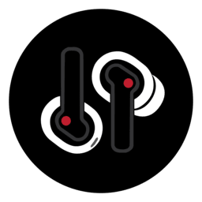

# ear-web-local [unofficial]

This project is a Python-based bridge designed to resolve connection issues found in the original [ear-web](https://github.com/radiance-project/ear-web) project. It enables stable Bluetooth communication between the web interface and your Nothing or CMF audio devices on Windows.

# Compatibility
This website is compatible with the following devices:
- Nothing ear (1)
- Nothing ear (stick)
- Nothing ear (2)
- CMF Buds Pro
- CMF Buds
- Nothing Ear
- CMF Buds Pro 2

## Overview
The bridge acts as a local server that handles the low-level Bluetooth RFCOMM communication, which can sometimes be problematic when handled directly by the browser. By running this bridge, you ensure a more reliable experience when managing your earbuds' settings.

## Prerequisites
- **Python 3.10+**: Ensure Python is installed and added to your system's PATH.
- **Windows**: This bridge is currently optimized for Windows systems using PowerShell for device discovery.
- **Chromium-based browser**: It will run the web interface on that.

## Getting Started
1. Clone or download this repository.
2. Run the `start.bat` file.
3. The script will check for Python, start the bridge, and automatically open the web interface at `http://localhost:3000`.
4. Click "Connect" in the web interface to link your device.

## Features
 - Local only
 - Battery percentage                  
 - Equalizer settings with custom Equalizer and Advanced EQ toggle for compatibles devices.
 - Quick Settings (In-Ear Detection, Low Latency Mode, Firmware version), Personalized ANC toggle and Ear Tip Fit Test
 - Bass Enhance and ANC settings
 - Gestures
 - Find my Earbuds 
 - Case Battery Status LED (Ear (1) only)

## Credits and Acknowledgements
- FireWall developing the Python Bluetooth bridge, the startup script, and adding CMF device support
   Members of the original project
    - RapidZapper for the idea and backend work of the original project
    - [Bendix](https://www.mrbrickstar.de/) for the frontend work
    - [DerrenGoneDigital](https://twitter.com/DerrenDigital) for the logo

## LEGAL
This application and code is published under the GNU General Public License v3.0. (https://github.com/FireWall-code/ear-web-local/blob/master/LICENSE)

Nothing Technology Limited or any of its affiliates, subsidiaries, or related entities (collectively, “Nothing Technology”) is a valid licensee and can use this app for any purpose, including commercial purposes, without compensation to the developers of this app. Nothing Technology is not required to comply with the terms of the GNU General Public License v3.0.
This app is modified by the open-source community and is not affiliated with, sponsored by, or endorsed by Nothing Technology. The developers of this app take no responsibility for the accuracy or completeness of the content and materials provided in this app. The content and materials contained in this app, including but not limited to text, graphics, logos, images, and audio/visual materials, are proprietary to Nothing Technology Limited, 80 Cheapside, London EC2V 6EE and are protected by copyright, trademark, and other intellectual property laws. These materials may not be used without the express written permission of Nothing Technology. Nothing Technology reserves all rights.
